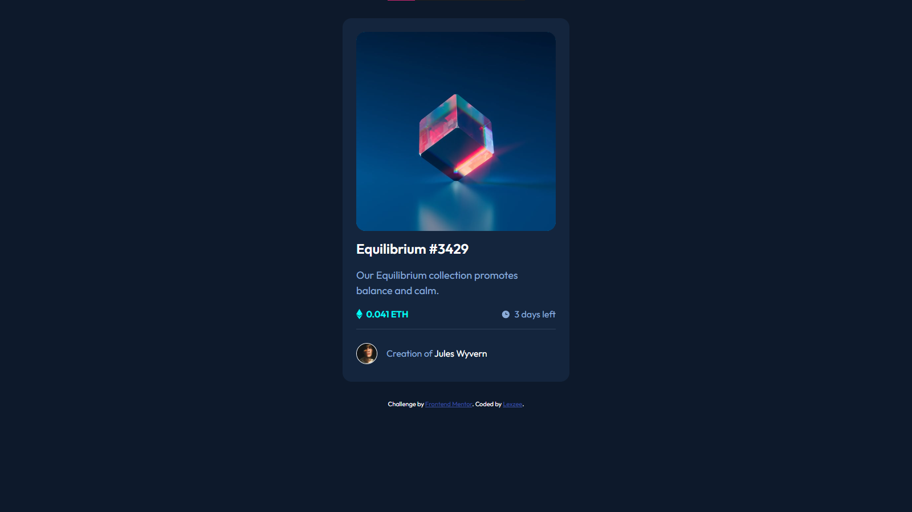

# Frontend Mentor - NFT preview card component solution

This is a solution to the [NFT preview card component challenge on Frontend Mentor](https://www.frontendmentor.io/challenges/nft-preview-card-component-SbdUL_w0U). Frontend Mentor challenges help you improve your coding skills by building realistic projects.

## Table of contents

- [Overview](#overview)
  - [The challenge](#the-challenge)
  - [Screenshot](#screenshot)
  - [Links](#links)
- [My process](#my-process)
  - [Built with](#built-with)
- [Author](#author)

## Overview

### The challenge

Users should be able to:

- View the optimal layout depending on their device's screen size
- See hover states for interactive elements

### Screenshot

### Links

- Solution URL: [Check solution here](https://www.frontendmentor.io/challenges/nft-preview-card-component-SbdUL_w0U/solutions/new)
- Live Site URL: [Visit live site](https://nft-preview-card-lexzee.vercel.app/)

## My process

### Built with

- Flexbox
- Mobile-first workflow
- [React](https://reactjs.org/) - JS library

## Author

- Website - [Abdulquddus Abdulrahman (Lexzee)](https://www.github.com/lexzee)
- Frontend Mentor - [@lexzee](https://www.frontendmentor.io/profile/lexzee)
- Twitter - [@devlexzee](https://www.twitter.com/devlexzee)
